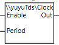
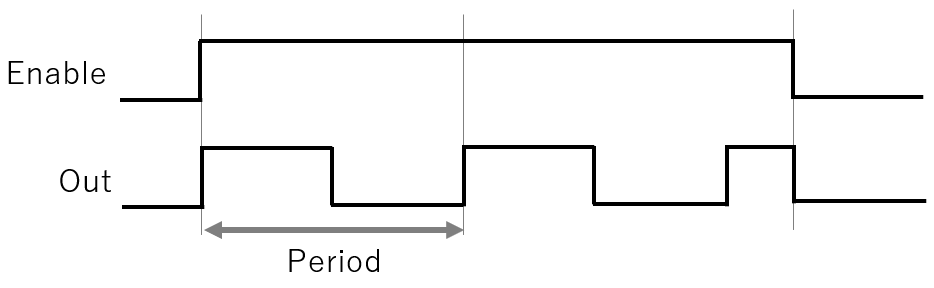

# 本リポジトリについて
## 概要
Omron NJ/NX/NY (SysmacStudio)で使用することができるClock FB（ファンクションブロック）です。  
指定周期ごとにON、OFFを繰り返す信号を出力することができます。  
Pull request（改善したプログラムの公開）、Issue（質問、バグ報告）大歓迎です。
  
## ファイル  
- ClockFB.csm2：プロジェクトファイル。ClockFBとClockFBの使用例が含まれています。
- ClockFB.slr：ライブラリファイル。ClockFBが含まれています。  
  
「ClockFB.slr」ではコードの変更することができないので、コードを変更したい方は、「ClockFB.csm2」を使用してください。
  
## 使用方法
- ClockFB.csm2を使用する場合：  
  SysmacStudioがインストールされたPCで、ダウンロードした「ClockFB.csm2」をダブルクリックすると、本プログラムが開きます。
  使用したいプロジェクトにファンクションブロックをコピーしてください。
- ClockFB.csm2を使用する場合：  
  「[Sysmac Studio Version 1 オペレーションマニュアル (SBCA-470)](https://www.fa.omron.co.jp/products/family/3077/download/manual.html)」の「9-3-2 ライブラリの利用」を参照してください。

  
# ClockFB
## 機能
指定した周期のクロック信号（ON、OFFを繰り返す信号）を出力します

## 入出力変数

|入出力|名称|データ型|エッジ|初期値|保持|コンスタント|コメント|
|:----|:----|:----|:----|:----|:----|:----|:----|
|入力|Enable|BOOL|ー|ー|ー|ー|TRUEで実行し、FALSEで停止します|
|入力|Period|TIME|ー|ー|ー|ー|クロック周期を指定します|
|出力|Out|BOOL|ー|ー|ー|ー|出力クロック信号です|

## タイミングチャート
- Enableの立上りで、OutはTRUEになります。（出力ONから始まります）　　
- Enable=FALSEで、OutはFALSEになります。

## 使用名前空間
- yuyuTds

## 注意点
- 入力変数Periodは、タスク周期の倍数を指定してください。倍数ではない場合、エラーになりませんが、出力の周期にズレが発生します。
- 本FBは、プライマリ定周期および、定周期タスクでのみ、使用可能です。

# ライセンスについて
本プログラムは、MITライセンスのもとで配布します。  
MITライセンスはオープンソースのソフトウェアライセンスの一つであり、ソフトウェアとそのソースコードを非常に寛容な条件下で使用、改変、再配布することを許可します。  
MITライセンスの特徴を以下に記載します。
- 著作権表示の保持：ライセンスされたソフトウェアを使用、改変、または再配布する際には、著作権表示およびライセンス条項の表示を保持することが求められます。
- 無保証：MITライセンス下で提供されるソフトウェアは、いかなる保証も伴わず、「現状有姿」で提供されます。つまり、ソフトウェアの品質や性能についての保証は一切ありません。
- 商用利用と非商用利用の両方が許可：MITライセンスは、商用プロジェクトおよび非商用プロジェクトの両方において、ソフトウェアの使用を許可します。
